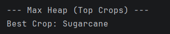
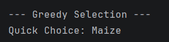
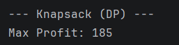
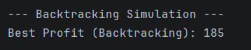

# 🌱 Data-Driven Crop Recommendation System Using Dynamic Environmental Inputs

An intelligent crop recommendation system that leverages advanced **data structures and algorithms** to optimize crop selection under dynamic environmental and resource constraints.

This project applies **AVL Trees, Heaps, Greedy algorithms, Dynamic Programming (0/1 Knapsack), and Backtracking** to model, analyze, and compare multiple decision strategies for agricultural planning.

---

## 📌 Problem Statement

Farmers often face the challenge of selecting the most profitable crops under limited water availability. Traditional decision-making is manual and suboptimal.

This system aims to:
- Model crops with water requirements and expected profit
- Apply multiple algorithmic strategies for recommendation
- Compare speed vs optimality across algorithms
- Identify the globally optimal crop combination under constraints

---

## 📁 Project Structure
│
├── src/                
│     ├── Crop.java
│     ├── LinkedList.java
│     ├── HashTable.java
│     ├── BST.java
│     ├── AVLTree.java
│     └── MaxHeap.java
│     ├── GreedySelector.java
│     ├── KNapsackDP.java
│     ├── Backtracking.java
│     ├── RecommendationEngine.java
│     ├── Main.java
│
├── results/            
│     ├── bst_output.png
|     ├── avl_output.png
|     ├── heap_output.png
│     ├── dp_output.png
│     ├── greedy_output.png
│     ├── backtracking_output.png
│
├── Data–Driven Crop Recommendation System Using Dynamic Environmental Inputs.pdf          
├── advanced data structures and algorithm analysis.pptx  
└── README.md

---

## ⚙️ Technologies Used

- **Language:** Java  
- **Core Concepts:** Data Structures & Algorithms  
- **Algorithms:**  
  - Dynamic Programming (0/1 Knapsack)  
  - Greedy Algorithm  
  - Backtracking  
- **Data Structures:**  
  - AVL Tree (Self-Balancing BST)  
  - Max Heap  
- **Paradigms:** Object-Oriented Programming, Algorithm Analysis, Simulation

---

## 🧠 System Architecture

- Crop Model (name, water requirement, profit)
- AVL Tree Module – sorted crop management
- Max Heap Module – top profit extraction
- Greedy Module – fast approximate selection
- Dynamic Programming Module – optimal solution
- Backtracking Module – exhaustive validation
- Recommendation Engine – integrates all approaches

---

## 🔬 Algorithms Implemented

### 1. AVL Tree
Maintains crops in sorted order with guaranteed **O(log n)** operations.

### 2. Max Heap
Efficiently identifies the highest-profit crop.

### 3. Greedy Algorithm
Selects crops based on profit-to-water ratio for fast approximation.

### 4. Dynamic Programming (0/1 Knapsack)
Computes the globally optimal crop combination under water constraints.

### 5. Backtracking
Explores all combinations to validate optimal profit.

---

## 📊 Sample Output
### AVL Tree – Sorted Crops Output

### Max Heap – Highest Profit Crop

### Greedy Selection Result

### Dynamic Programming (0/1 Knapsack) Result

### Backtracking Simulation Result

### System Execution Completion

---

## 📈 Observations

- Greedy is fast but may be suboptimal  
- DP and Backtracking give the same optimal result  
- AVL Tree and Heap ensure efficient data handling  
- Clear trade-off between performance and optimality

---

## 🚀 How to Run

1. Clone the repository  
2. Open in any Java IDE (IntelliJ / Eclipse / VS Code)  
3. Run `Main.java`  
4. Modify water limits to test scenarios

---

## 🧩 Future Scope

- Real-time weather API integration  
- GUI-based farmer interface  
- Soil nutrient parameter inclusion  
- Multi-season planning support  
- ML-based yield prediction

---

⭐ If you find this project useful, consider starring the repository!
